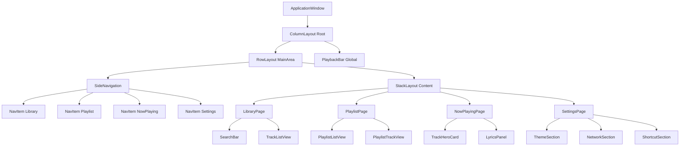

# 小熊音乐播放器 UI 重构规范（V1）

## 1. 文档目标与约束

- 目标：将当前四宫格页面重构为 **左侧导航 + 右侧主内容 + 底部全局播放条** 的桌面应用布局，提升信息层次、可扩展性与操作效率。
- 技术边界：面向 Qt 6 / QML（Qt Quick Controls 2）落地，优先使用原生能力（`Rectangle`、`Frame`、`Behavior`、`States`、`Transitions`）。
- 风格边界：现代简约、轻透明、轻动画；不使用高饱和渐变、复杂玻璃拟态、夸张位移动画。
- 本规范仅定义 UI/UX 实施标准，不涉及 C++ 播放内核逻辑改造。

---

## 2. 视觉设计原则

### 2.1 现代简约（信息优先）

- 页面以内容可读性为第一优先，弱化装饰。
- 单屏只保留一个主视觉焦点（当前页面标题或当前播放信息）。
- 组件边框与分割线使用低对比度，避免视觉噪音。

### 2.2 层级清晰（导航与内容分离）

- 左侧导航负责“去哪”，右侧内容负责“看什么/做什么”。
- 底部播放条在全局常驻，避免在各页面重复放置播放控件。
- 每页遵循三层结构：页面标题区、工具区、内容区。

### 2.3 轻透明与圆角（Qt6 可实现）

- 容器卡片允许使用低透明背景（`opacity 0.88~0.96`）。
- 统一圆角系统，避免同屏混用过多半径。
- 阴影仅用于浮层（菜单、弹窗），常驻面板不加重阴影。

### 2.4 轻动画（反馈而非表演）

- 动画仅用于状态切换反馈：悬停、按下、页面切换、面板展开收起。
- 默认使用 120ms~220ms 的短时长，Easing 选 `OutCubic`/`InOutCubic`。
- 动画不得影响操作响应（按钮点击应立即触发业务逻辑）。

---

## 3. 主题 Token 规范（可直接映射 QML 单例）

> 建议新增 `qml/theme/Theme.qml` 单例，以下 token 为实施最低集合。

### 3.1 颜色（Color Tokens）

| Token | Light | Dark | 用途 |
|---|---|---|---|
| `color.bg.app` | `#F6F7F9` | `#15171A` | 应用背景 |
| `color.bg.panel` | `#FFFFFF` | `#1D2127` | 主面板背景 |
| `color.bg.elevated` | `#FFFFFFF2` | `#242A33E6` | 浮层/卡片（轻透明） |
| `color.bg.hover` | `#EEF2F7` | `#2A3140` | 悬停背景 |
| `color.bg.pressed` | `#E3E9F1` | `#323B4C` | 按下背景 |
| `color.primary` | `#3B82F6` | `#60A5FA` | 主色（高亮/选中） |
| `color.primary.active` | `#2563EB` | `#3B82F6` | 主色激活态 |
| `color.text.primary` | `#111827` | `#F3F4F6` | 主文本 |
| `color.text.secondary` | `#4B5563` | `#B6BEC9` | 次文本 |
| `color.text.muted` | `#9CA3AF` | `#7F8A9B` | 辅助文本 |
| `color.border.default` | `#E5E7EB` | `#313845` | 默认边框 |
| `color.border.focus` | `#60A5FA` | `#60A5FA` | 聚焦边框 |
| `color.state.error` | `#DC2626` | `#F87171` | 错误态 |
| `color.state.warning` | `#D97706` | `#F59E0B` | 警告态 |
| `color.state.success` | `#16A34A` | `#4ADE80` | 成功态 |

### 3.2 圆角（Radius Tokens）

- `radius.xs = 6`：输入框、小按钮
- `radius.sm = 8`：导航项、列表项
- `radius.md = 12`：面板、卡片
- `radius.lg = 16`：大卡片、封面容器
- `radius.pill = 999`：胶囊标签/模式按钮

### 3.3 间距（Spacing Tokens）

- `space.1 = 4`
- `space.2 = 8`
- `space.3 = 12`
- `space.4 = 16`
- `space.5 = 20`
- `space.6 = 24`
- `space.8 = 32`
- `space.10 = 40`

布局约束：
- 页面外边距统一 `24`。
- 同级主区块纵向间距 `16`。
- 控件组内间距 `8` 或 `12`。

### 3.4 字体层级（Typography Tokens）

- `font.family = "Microsoft YaHei UI"`（Windows 默认），其他平台回退系统无衬线。
- `font.h1 = 24 / weight 600`：页面主标题
- `font.h2 = 18 / weight 600`：区块标题
- `font.body = 14 / weight 400`：正文与列表
- `font.caption = 12 / weight 400`：辅助说明
- `font.mono = 12 / weight 400`：时间码、调试信息（可选）

### 3.5 动效时长（Motion Tokens）

- `motion.fast = 120ms`：hover/press
- `motion.normal = 180ms`：面板状态切换
- `motion.slow = 220ms`：页面内容切换
- `motion.easing.standard = Easing.OutCubic`
- `motion.easing.emphasized = Easing.InOutCubic`

---

## 4. 信息架构与主布局蓝图

## 4.1 全局框架

- 根布局：`ColumnLayout`
  - 上层：`RowLayout`（左侧导航 + 右侧主内容）
  - 下层：`PlaybackBar`（固定高度，建议 `84`）
- 左侧导航宽度：`240`（可收起到 `72`，作为后续增强）
- 右侧内容区：自适应填充
- 全局最小窗口：`1024 x 680`

## 4.2 导航结构

导航顺序与需求文档一致：
1. `Library`（曲库）
2. `Playlist`（播放列表）
3. `NowPlaying`（正在播放）
4. `Settings`（设置）

规则：
- 导航项支持图标 + 文案。
- 当前页使用主色高亮背景与文本。
- 导航切换时仅切内容，不重建底部播放条。

---

## 5. 页面蓝图（可直接映射 QML Page）

## 5.1 Library 页面

### 页面结构

1. 标题区：`"曲库"` + 曲目数量（如 `2,013 首`）
2. 工具区：`SearchBar` + 筛选器（歌名/歌手/专辑）
3. 内容区：歌曲列表（`ListView` + 虚拟化）
4. 侧边信息（可选）：当前选中歌曲简要信息

### 关键行为

- 搜索输入后 150ms 防抖触发过滤。
- 回车：播放当前高亮项。
- 双击列表项：立即播放并切到 `NowPlaying`（可配置）。
- 列表项显示播放状态（正在播放/暂停）。

## 5.2 Playlist 页面

### 页面结构

1. 标题区：`"播放列表"` + 新建按钮
2. 左列：播放列表集合（名称 + 数量）
3. 右列：选中列表的歌曲明细
4. 顶部工具：重命名/删除/排序入口

### 关键行为

- 新建与重命名采用行内编辑，失焦自动提交。
- 删除前二次确认（`Dialog`）。
- 列表内排序优先拖拽（后续可加上下移动按钮兜底）。

## 5.3 NowPlaying 页面

### 页面结构

1. 上部：封面、歌曲名、歌手、专辑、播放模式标签
2. 中部：`LyricsPanel`（主内容）
3. 下部：歌词来源信息与手动重试按钮（若失败）

### 关键行为

- 无歌词时展示空态文案 + “选择歌词文件/在线重试”。
- 歌词滚动跟随播放位置，支持点击某行跳播（可选增强）。
- 错误信息在该页显式可见，颜色使用 `color.state.error`。

## 5.4 Settings 页面

### 页面结构

1. 外观：主题模式（浅色/深色/跟随系统）
2. 通用：语言、默认扫描目录
3. 网络：歌词联网开关
4. 快捷键：固定键位说明清单

### 关键行为

- 所有设置项采用“标题 + 描述 + 控件”三段式行布局。
- 开关类设置即时生效并持久化。
- 目录选择使用标准 `FileDialog`/`FolderDialog`。

---

## 6. 组件边界规范（重点组件）

## 6.1 `PlaybackBar`

### 职责

- 全局播放控制入口，常驻底部，不随页面切换卸载。

### 输入（Props）

- `required property var playback`
- `required property var queue`（若暂不存在可预留）
- `property bool compact: false`

### 输出（Signals）

- `signal playPauseRequested()`
- `signal previousRequested()`
- `signal nextRequested()`
- `signal seekRequested(int positionMs)`
- `signal volumeRequested(int value)`
- `signal modeToggleRequested()`

### 不负责

- 不执行文件选择、不执行歌词加载、不管理曲库过滤。

## 6.2 `SearchBar`

### 职责

- 统一搜索输入、清空按钮、可选筛选入口。

### 输入（Props）

- `property string text`
- `property string placeholderText: "搜索歌名 / 歌手 / 专辑"`
- `property bool loading: false`
- `property bool enabled: true`

### 输出（Signals）

- `signal textEdited(string value)`（实时变化）
- `signal searchCommitted(string value)`（回车或点击搜索）
- `signal cleared()`

### 不负责

- 不直接请求数据源，仅抛出事件给页面容器层。

## 6.3 `LyricsPanel`

### 职责

- 展示歌词内容、高亮当前行、滚动同步、错误/空态展示。

### 输入（Props）

- `required property var lyricsModel`
- `property int currentPositionMs: 0`
- `property string state: "idle"`（`idle/loading/ready/error/empty`）
- `property string errorText: ""`

### 输出（Signals）

- `signal lineActivated(int timestampMs)`（点击歌词跳播）
- `signal retryRequested()`
- `signal selectLocalLyricRequested()`

### 不负责

- 不负责在线检索策略决策，不直接发网络请求。

---

## 7. 交互状态规范（Default / Hover / Pressed / Disabled / Error）

## 7.1 通用规则

- 所有可点击控件必须覆盖五态；不可点击控件至少支持 `default/disabled`。
- 状态切换优先改 `color` 与 `border`，避免大幅位移。
- `error` 态仅在输入校验失败、加载失败、播放异常时使用。

## 7.2 Button（主按钮）

- `default`：背景 `color.primary`，文本白色。
- `hover`：背景 `color.primary.active`，亮度提升约 6%。
- `pressed`：背景比 hover 再降低约 8%，触发 `motion.fast`。
- `disabled`：背景 `#9CA3AF66`，文本 `#FFFFFF99`，`enabled: false`。
- `error`：背景 `color.state.error`，用于“重试失败”等操作。

## 7.3 GhostButton（次按钮）

- `default`：透明背景 + `color.text.secondary` 文本。
- `hover`：背景 `color.bg.hover`。
- `pressed`：背景 `color.bg.pressed`。
- `disabled`：文本 `color.text.muted`。
- `error`：文本与边框改为 `color.state.error`。

## 7.4 TextField（搜索框/输入框）

- `default`：背景 `color.bg.panel`，边框 `color.border.default`。
- `hover`：背景不变，边框轻微加深。
- `pressed/focus`：边框 `color.border.focus`，可加 1px 外发光（低透明）。
- `disabled`：背景降低对比，文本 `color.text.muted`。
- `error`：边框与提示文本 `color.state.error`，保留焦点可修复。

## 7.5 ListItem（列表项）

- `default`：透明背景。
- `hover`：背景 `color.bg.hover`。
- `pressed`：背景 `color.bg.pressed`。
- `disabled`：整体 `opacity 0.45`。
- `error`：右侧状态标签标红（用于不可播放文件）。

---

## 8. Mermaid 组件树（目标结构）

---

## 9. QML 实施落地建议（执行顺序）

1. 先引入 `Theme` 单例与 token，不改业务逻辑。
2. 将 `Main.qml` 由 2x2 `GridLayout` 改为 `RowLayout + StackLayout + PlaybackBar`。
3. 页面内部逐步替换为统一组件（先 `SearchBar`，再 `LyricsPanel` 状态化）。
4. 最后补齐状态样式（hover/pressed/disabled/error）与轻动画。

验收标准（UI）：
- 4 个页面可通过左侧导航切换；
- 底部播放条始终可见且可操作；
- 主题 token 在主要组件可复用，不出现硬编码色值泛滥；
- 交互五态在按钮、输入框、列表项中可观察。
